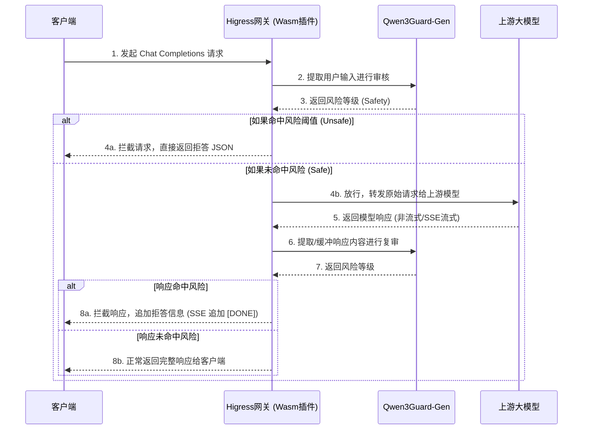

    

        

            

            

            

        

        
bash

    

    

        
ckhuang@macbookpro:~$ 生成式 AI 早就跨越了“能不能用”的门槛，现在的核心痛点是“如何规模化地安全使用”。如果每个应用都自己在代码里维护一套审核 SDK 和拒答逻辑，那绝对是一场架构灾难！ 

    

最近看到 Higress 项目以 Wasm 插件形式接入了 Qwen3Guard-Gen，这让我感到非常兴奋。作为一名在分布式架构摸爬滚打多年的老兵，我一直坚信：**横切关注点（Cross-Cutting Concerns）就应该下沉到基础设施层**。

今天，我们就来深度聊聊，Higress 结合 Qwen3Guard 是如何做到“不改一行业务代码，把 AI 内容安全做进网关主链路”的，以及这背后隐藏的工程智慧。

## 一、为什么要把 AI 安全做到网关层？

在传统的微服务架构中，鉴权、限流、熔断这些通用能力我们都会毫不犹豫地放到网关层。但在大模型（LLM）应用开发的早期，很多团队为了追求快，往往把 AI 内容审核直接硬编码在业务逻辑里。

这样做有什么问题？
1. **策略碎片化**：随着应用增多，风险阈值和拒答逻辑散落在多个代码仓库，一旦需要升级安全模型或调整策略，就得全盘改造。
2. **重复造轮子**：每个应用都要处理冗长繁琐的 LLM API 协议解析，尤其是令人头疼的 SSE（Server-Sent Events）流式数据拼接。
3. **资源浪费**：如果恶意请求已经进入了昂贵的大模型推理阶段再做阻断，算力已经被浪费了。

Higress 接入 Qwen3Guard 给出了一个教科书般的解决方案，总结起来就三句话：
- **业务零改造**：应用继续使用熟悉的 `Chat Completions` 协议，上游模型也不用改。
- **输入、输出、流式全覆盖**：请求进去前审一遍，结果（包括非流式 JSON 和 SSE 流式）出来后再审一遍。
- **安全模型自托管**：Qwen3Guard 独立部署，风险阈值和拒答文案由网关统一配置，不依赖任何云端黑盒服务。

## 二、架构深度解析：一次完整调用是如何被保护的？

这不是简单地在网关旁边挂一个安全样例，而是把内容提取、风险决策和流式缓冲真正放进了数据面链路。Higress 在这里扮演了“执行者”的角色，而 Qwen3Guard 则是“裁判”。

为了让大家更直观地理解，我画了一张核心交互的时序图：

### 1. 请求侧：先审核，再放行
在请求侧，Higress Wasm 插件会按 `maxBodyBytes` 缓冲请求体，使用 GJSON Path `messages.@reverse.0.content` 提取最后一条用户输入。
提取成功后，插件按照 Qwen3Guard-Gen 的官方 Prompt Moderation 结构构造请求。如果判定为 `Unsafe`，网关直接返回配置好的 `denyMessage`（如“很抱歉，我无法回答您的问题”），**根本不会消耗上游大模型的算力**。

### 2. 响应侧：非流式与 SSE 流式的挑战
对于普通的 HTTP 200 非流式响应，处理起来相对简单，缓冲完整 JSON 后提取 `choices.0.message.content` 即可。

**但真正的工程难点在于 SSE 流式响应的审核。**

大模型的流式输出是一个个 Token 蹦出来的。Higress 插件目前的做法是：**分段缓冲，重复送审**。
- 插件会识别 `Content-Type: text/event-stream`，收集新增文本。
- 维护两份状态：**完整累计回复** 和 **自上次检查后的新增文本**。
- 默认每新增 1000 个 Unicode 字符触发一次检查。

一旦命中风险，由于之前的安全片段已经发给了客户端（覆水难收），插件只能**丢弃尚未释放的数据，并向流中追加拒答的 SSE 事件**。这非常符合分布式系统中的“最终一致性”妥协，也是网关层做流式拦截的唯一正解。

    “架构设计的本质是权衡。流式审核的窗口大小（streamBufferChars），就是首字延迟、Qwen3Guard 算力开销与漏检风险之间的博弈。” —— CK·黄

## 三、工程落地：部署与排坑指南

在实际生产环境中落地这套方案，有几个我总结的“排坑”建议：

### 1. 优先级配置（Priority）的玄机
Higress 的 Wasm 插件执行顺序由 `phase` 和 `priority` 决定。强烈建议 `qwen3guard` 插件使用 **默认阶段 + priority: 300**。
为什么要这样设置？
因为在请求侧，我们需要 `qwen3guard` 先于 `ai-proxy` 执行，以便直接拿到应用发来的原始 OpenAI 格式请求体；而在响应侧，Envoy 的响应路径是相反的，`qwen3guard` 会在 `ai-proxy` 之后执行，这样正好能处理被 `ai-proxy` 归一化后的 OpenAI 格式响应。**这个优先级的设定，堪称神来之笔。**

### 2. 拥抱 Fail-Open 机制
任何依赖外部服务的链路，都必须考虑外部服务挂掉的情况。
当前插件选择了 `fail-open`（降级放行）机制。当 Qwen3Guard 超时、不可达或返回异常格式时，插件会记录警告并放行当前请求。
在可用性和安全性之间，网关默认优先保证了业务的**高可用**。但这也提醒我们，**生产环境必须完善针对 Qwen3Guard 可用率、调用时延和插件警告日志的监控体系**，否则你将处于“裸奔”状态而不自知。

### 3. DNS 接入集群外服务的坑
如果你的 Qwen3Guard 部署在 K8s 集群外，需要用到 `serviceSource: dns`。此时你需要配置 Istio 的 `ServiceEntry`。请务必注意：`ServiceEntry` 负责让 Envoy 拥有目标 cluster，而插件配置负责选择该 cluster 并设置实际的 HTTP Host。不要在 `serviceName` 里重复写 `.dns` 后缀。

## 四、总结

生成式 AI 时代的网关，正在从单纯的流量代理，进化为**具备深度内容感知能力的智能数据面**。

Higress 接入 Qwen3Guard 这一方案，不仅仅是多了一个功能插件，更是提供了一条可复用的、标准的 AI 安全链路。它让安全逻辑回归到了基础设施层，让业务开发同学可以更加专注于核心价值的创造。

在这个 AI 技术狂飙突进的时代，保持终身学习，洞察底层架构演进的逻辑，才能在变化中找到不变的基石。对于正在构建 AI Agent 或大模型应用的团队来说，是时候把你的 AI 护城河，建在网关上了。
