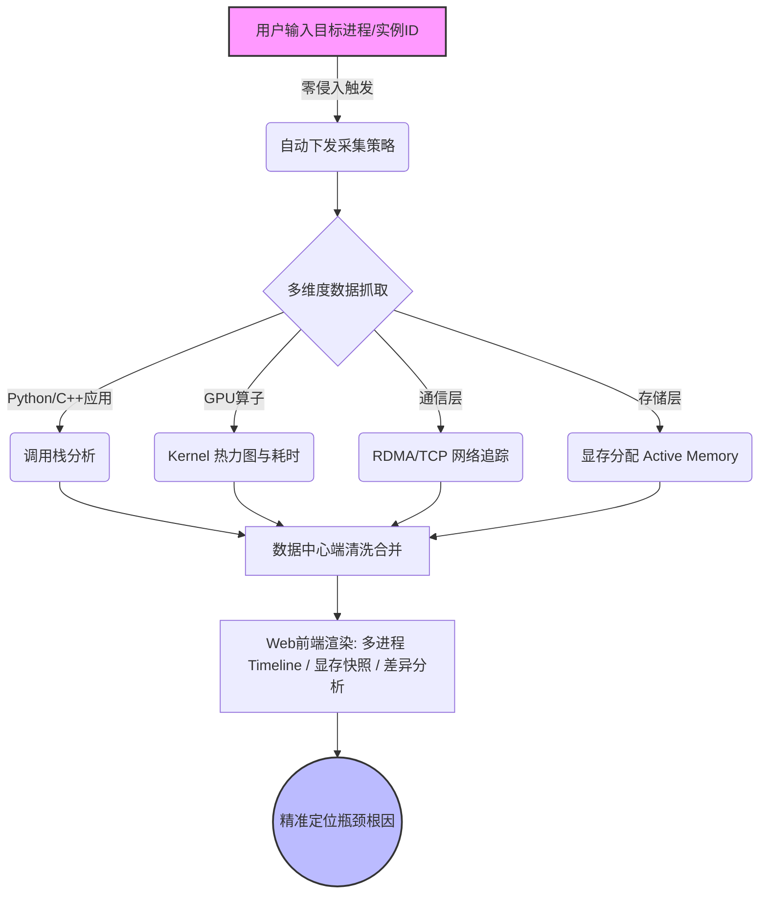

    

        

            

            

            

        

        
bash

    

    

        
ckhuang@macbookpro:~$ 训练任务跑了几小时，一看 GPU 利用率不到 30%；大模型推理服务刚上线，显存就像脱缰的野马一路狂飙直到 OOM。你是不是也常常对着一堆报错，发出灵魂拷问：我的算力究竟被谁吃掉了？读完这篇，带你彻底告别 AI 集群性能调优的“盲人摸象”。 

    

在 AI 大模型时代，算力就是最昂贵的生产资料。然而，在实际的业务落地中，我们常常遇到各种“性能刺客”：千卡集群里某几张卡的通信延迟拖慢了全局，或是某些隐藏的显存碎片不知不觉吃光了资源。

传统的排查方式往往极其痛苦，今天我们就来聊聊，如何借助阿里云云原生团队推出的零侵入 **SysOM AI Profiling** 工具，像外科手术一样精准剖析 GPU 性能黑洞。

### 为什么我们手里的工具“不香了”？

如果你曾在分布式系统里排查过性能瓶颈，你一定用过各种 Profiling 工具：
- 有的能抓取 CUDA Stream 和 Kernel，但只能输出离线的 Trace 文件，看着 Chrome Tracing 密密麻麻的色块头皮发麻。
- 有的基于 eBPF 抓取内核态的 CPU 和系统调用，但在 GPU 侧几乎是“盲人”。
- 还有的强依赖框架版本（比如只能用特定版本的 Torch），对业务代码有极强的侵入性。

这些工具的通病在于：**“只见树木，不见森林”**。维度孤立、数据难以联动、业务侵入性强。你很难在一个视图里，把 Python 调用栈、GPU Kernel、RDMA 通信和显存分配全部串联起来。

### 破局：全维度、零侵入的观测体系

我们需要的是什么？是一个**无感接入**的“上帝视角”。SysOM AI Profiling 给出的解法非常优雅：只需输入目标实例 ID，系统自动完成“采集 -> 回传 -> 分析 -> 渲染”，全程不需要改一行代码，甚至不用重启进程。

如上图所示，这种体系最强大的地方在于**多源异构数据的融合**。无论是宏观的耗时分布，还是微观的某次 `cudaMalloc`，都能在同一个时间轴（Timeline）上对齐。

### 深度剖析：扒开 GPU 的黑盒

让我们来看看 AI Profiling 提供的两个杀手锏级功能。

#### 1. 显存快照时序图 (Active Memory Timeline)
在深度学习训练中，显存泄露是最让人头疼的问题之一。传统 `nvidia-smi` 只能看到一个总量，无法告诉你显存是如何被分配和释放的。
AI Profiling 的显存时序图可以微观展示采样期间所有显存块（block）的生命周期。如果你锁定了一个异常的 block，还能直接溯源到对应的 Python 调用堆栈，揪出到底哪行代码“借了不还”。

#### 2. 基于迭代锚点的差分分析
大规模分布式训练的 Trace 数据动辄数 GB，纯靠肉眼看 Timeline 无异于大海捞针。
AI Profiling 巧妙地利用了“迭代标记（Iteration Anchor）”，把流水线切分成独立的迭代单元。通过柱状图对比每个迭代的 Loss 值、计算耗时和通信延迟，我们可以“一眼识别”离群点。比如发现某次迭代的梯度爆炸，或者突然飙升的 RDMA 通信耗时。

    “性能优化不应是一场碰运气的盲盒游戏，而是一场基于多维数据的精准外科手术。” —— CK·黄

### 实战踩坑：vLLM 显存泄漏追踪记

理论讲完，来看一个真实的踩坑案例。
有用户在部署 vLLM 大模型推理服务时，明明启动时按比例预分配了显存，跑着跑着还是 OOM 了，并且监控显示显存在诡异地持续增长。

如果靠传统方法排查，可能得在源码里到处打日志。但在接入 AI Profiling 后，整个破案过程非常丝滑：

1. **宏观锁定**：打开 GPU Kernel Timeline，一眼就看到显存增长的峰值集中在大量密集的 `cudaMalloc` 操作上。
2. **微观下钻**：在时间轴上圈定这块异常区域，向下钻取到 Python 调用栈。
3. **真相大白**：定位到是推理请求处理时，框架的上下文管理逻辑在动态预留额外的显存。
4. **原理深究**：这其实与 PyTorch 的底层显存分配器（Allocator）有关。PyTorch 为了减少频繁向系统申请显存的开销，会采用 block 缓存机制。随着推理复杂度的变化，缓存的碎片越来越多。`nvidia-smi` 显示的占用不仅是已使用的，还包括这些缓存块（`reserved_memory`）。

**解决方案**：除了在代码层面手动 `torch.cuda.empty_cache()` 外，更优雅的做法是通过环境变量 `CUDA_PYTORCH_CUDA_ALLOC_CONF` 调小 `max_split_size_mb`，从根本上降低显存碎片化的影响。

### 总结与展望：走向 AI 自治的 Profiling Agent

从发现问题到解决问题，中间隔着巨大的认知鸿沟。SysOM AI Profiling 帮我们把“黑盒”变成了“白盒”，让我们能清晰地**看见问题**。

但技术的演进不会止步于此。作为 AI Agent 的探索者，我非常看好阿里云后续推出的 **Profiling Agent**。它试图将资深专家的排查经验固化为大模型的分析能力，实现从“感知 -> 诊断 -> 分析 -> 修复建议”的自动化闭环。
试想一下，未来你的 AI 员工在后台监控着千卡集群，不仅能发现通信长尾，还能自动给你发一条包含修复建议和根因分析的诊断报告，这才是智能运维的终极形态。
