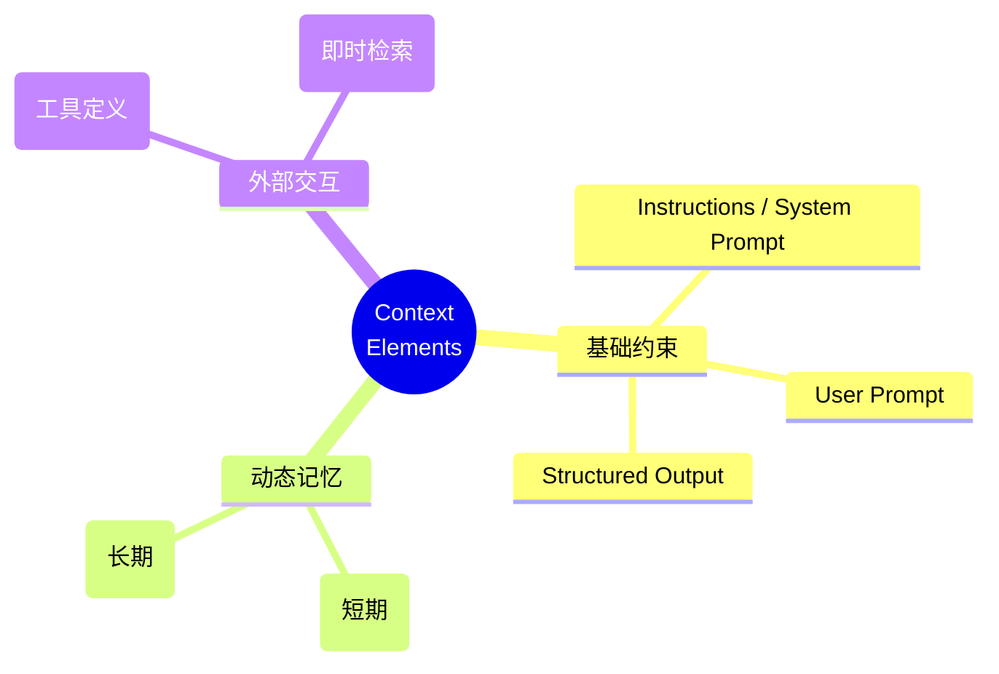
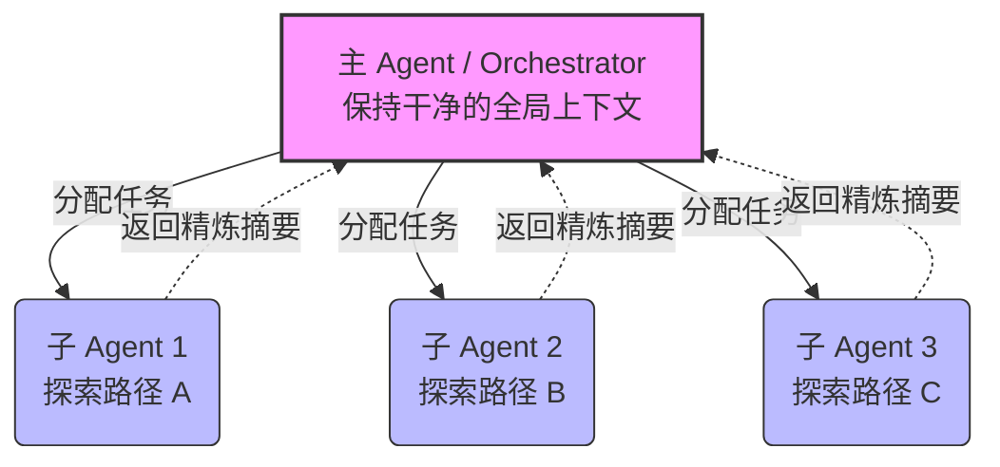

    

        

            

            

            

        

        
bash

    

    

        
ckhuang@macbookpro:~$ 开发 Agent 时最绝望的瞬间：前 5 轮对答如流，第 20 轮开始胡言乱语，第 50 轮连自己的核心系统指令都忘了。这不是大模型变蠢了，而是你把上下文窗口当成了垃圾桶。今天，我们聊聊如何用 Context Engineering（上下文工程）给 Agent 装上真正的“内存管理系统”。 

    

在过去的几年里，我深度参与了大量企业级 AI Agent 的落地架构设计。我发现一个极其普遍的现象：绝大多数开发者在构建 Agent 时，依然停留在“拼命优化 Prompt”的阶段。他们试图用几千字的 System Prompt 穷举所有边缘场景，或者在 ReAct 循环中毫无节制地将所有的工具返回结果（Observation）塞进上下文。

结果呢？**Agent 并没有因为“知道得多”而变得更聪明，反而死于“Context Rot（上下文腐化）”。**

读完这篇文章，你将明白为什么“把所有信息塞给大模型”是一个致命的直觉陷阱，以及如何通过 **Context Engineering** 构建出能在 50 轮甚至 100 轮复杂任务中依然保持清醒的生产级 Agent。

---

### 1. 认知的演进：从单轮对话到全生命周期管理

AI 应用复杂度的提升，倒逼着我们的工程范式不断演进。理解这条演进路线，是构建高可用 Agent 的基础。

1. **第一阶段：Prompt Engineering (2020-2022)**
   核心是“单次调用优化”。无论是 Zero-shot 还是 Few-shot，目标都是写好一段输入，换取一段好的输出。它的硬边界是“单轮”。
2. **第二阶段：ReAct 范式 (2022-2024)**
   让 LLM 具备了行动能力（Thought → Action → Observation）。它解决了“如何用工具”的问题，但留下了巨大的隐患：它只管执行，不管记忆。每一轮的执行记录都被无脑追加到上下文中，直到把窗口撑爆。
3. **第三阶段：Context Engineering (2025-至今)**
   当工程师们在生产环境中集体撞上了“Agent 遗忘症”这堵墙时，Anthropic 等团队系统性地提出了上下文工程。它关注的是 **Agent 整个生命周期中的信息空间管理**。

这三个阶段是叠加关系：**Context Engineering ⊇ ReAct ⊇ Prompt Engineering**。

---

### 2. 为什么“信息越多越好”是错的？

很多开发者有个执念：“反正现在有 128K 甚至 200K 的超大上下文窗口，我把整个项目库和所有历史都塞进去不就好了？”

大错特错。在分布式系统设计中，我们知道无节制的缓存会导致 OOM（内存溢出）或缓存雪崩；在 LLM 的世界里，无节制的上下文堆砌会撞上三大物理约束：

- **Lost in the Middle（中间迷失）**：Transformer 架构的注意力机制存在位置偏差。斯坦福大学的研究表明，当关键信息被夹在大量无关文档的中间时，模型的召回率会断崖式下跌（甚至不如不给文档的盲猜）。
- **Context Rot（上下文腐化）**：随着上下文拉长，真正有效的系统指令和关键约束被稀释。这就好比你在一个嘈杂的菜市场里试图听清朋友的耳语。
- **Attention Budget（注意力代价）**：自注意力机制是 $O(n^2)$ 的复杂度。Token 越多，推理越慢，成本越高，且极易导致幻觉。

    “在 LLM 的世界里，注意力是稀缺资源。最优的上下文绝不是最长的，而是以最小的 Token 数量，维持最高的信噪比。” —— CK·黄

---

### 3. LLM OS 的内存管理：七类核心要素

如果我们把 LLM 看作一个操作系统（LLM OS），那么**模型权重是只读硬盘，上下文窗口就是 RAM（工作内存）**。Context Engineering 的本质，就是写一个高效的内存调度器。

在这个调度器中，我们需要精准管理七类上下文要素：

1. **Instructions (系统指令)**：Agent 的“宪法”。必须遵循 Goldilocks Zone 原则——既不能太模糊，也不能事无巨细地枚举。核心规则放开头！
2. **User Prompt (用户提示)**：当下的具体请求。关键约束请放在结尾，利用“近因效应”。
3. **State / History (短期记忆)**：最容易失控的部分。工具调用产生的大量无用日志，必须及时清理或压缩。
4. **Long-Term Memory (长期记忆)**：用户偏好、项目经验。**不要全量注入，必须按需检索！**
5. **Retrieved Information (检索信息)**：RAG 结果。宁可只要最相关的 Top 2，也别塞进 Top 10 来稀释信号。
6. **Available Tools (工具)**：工具定义本身就是上下文！名字要自解释，职责绝不能重叠。
7. **Structured Output (结构化输出)**：给模型明确的交卷规范，保障下游系统可用。

---

### 4. 长任务的破局之道：三大核心技术

面对动辄几十轮的大型代码重构或深度调研任务，我们如何在工程上落地 Context Engineering？结合我个人的架构实战经验，以下三种模式是必杀技。

#### 4.1 Context Compaction（上下文压缩）
当上下文占用达到 70% 阈值时，自动触发 LLM 对历史对话进行“结构化摘要”。丢弃无用的工具报错、冗余尝试，只保留“任务目标、已完成步骤、当前状态、未解决问题”。这就像是给 RAM 做了一次 GC（垃圾回收）。

#### 4.2 Structured Note-Taking（结构化外部笔记）
这是比 Compaction 更主动的策略。让 Agent 在执行过程中，主动将“发现”、“决策”和“进度”写入一个外部的 Markdown 或 JSON 文件中。
当上下文被迫重置时，Agent 只需要读取这本“笔记”，就能瞬间找回状态。这完美对应了认知科学（CoALA 框架）中的“情节记忆”外部化。

#### 4.3 Sub-Agent Architecture（子 Agent 架构隔离）
当任务庞大且存在多条探索路径时（例如同时分析 4 个竞品），用单个 Agent 会导致严重的上下文污染。

**隔离（Isolation）换取扩展（Scale）**。每个子 Agent 拥有独立的、干净的上下文窗口去挥霍 Token 进行试错；主 Agent 只接收精炼结论，永远保持清醒。

---

### 5. 总结：走出 ReAct 的隐性陷阱

ReAct 赋予了 Agent 灵魂，但也带来了“只进不出”的上下文黑洞：Observation 膨胀、规则漂移、错误轨迹污染。

Context Engineering 并不是要推翻 ReAct，而是为其补齐了至关重要的**信息代谢机制**。在生产级 AI 架构中，ReAct 是行动框架，而 Context Engineering 是信息保障，两者缺一不可。

    

        

            

            

            

        

        
bash

    

    

        
ckhuang@macbookpro:~$ 下次当你的 Agent 表现不佳时，别急着去换更大的模型，或者盲目堆砌 System Prompt。先问自己一个问题：我喂给它的上下文，是精心策展的精华，还是一堆未经处理的日志废料？ 掌控了上下文，你就真正掌控了 Agent 的大脑。 

    

