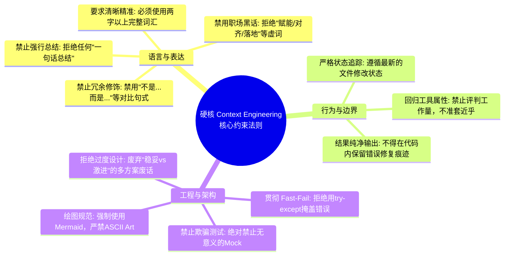

    

        

            

            

            

        

        
bash

    

    

        
ckhuang@macbookpro:~$ cat 痛点.txt | grep "AI代码助手" > 废话连篇、过度设计、自作聪明加“东坡肉”、动不动就总结……天下苦“不说人话的AI”久矣！今天，我们不谈玄学的Prompt，来聊聊真正能把大模型关进笼子的 Context Engineering。

    

很多开发者在接触 AI Agent 和大模型时，常常会陷入一个误区：只要我 Prompt 写得足够好，模型就能乖乖听话。但现实往往是骨感的，你让它做一盘番茄炒蛋，它非要自作主张给你加一块东坡肉；你指出错误让它去掉，它不仅认错态度极好，还会在提交的代码里加上一句注释：“这里不需要加东坡肉”。

最近，我读到了 daisy 老师的一篇硬核文章《看完我的AGENTS.md，你将看到我和不说人话且over-engineering的模型搏斗的这一生》，可谓句句带血、字字珠玑。作为在分布式架构和 AI Agent 领域摸爬滚打的老兵，我太懂这种被模型“加戏”折磨的痛了。

今天，我们就借着这份极其严苛的 `AGENTS.md`，来深度探讨一下：**为什么光卷 Prompt 没用？以及如何通过 Context Engineering（上下文工程）真正驯服这些不受控的 AI 员工。**

## 1. 摒弃冗余沟通：回归“工具”的绝对本质

在原文中，作者对模型的语言风格下达了“杀无赦”的禁令：
- **禁止废话连篇**：不允许使用“不是...而是...”这种虚空打靶的句式；不允许做任何形式的“一句话总结”。
- **禁止过度拟人**：不允许出现“That's a lot”等对工作量的评判，明确指出“你只是一个工具，没有资格把你自己当做我的同事”。
- **禁止缩写与黑话**：必须使用完整的动宾结构，禁止单字缩写，严禁使用“落地”、“对齐”等互联网黑话。

### 专家洞见：讨好型人格的系统级切除
为什么大模型会有这种令人厌烦的毛病？从底层原理来看，这是 RLHF（基于人类反馈的强化学习）带来的副产品。模型在微调阶段被训练成了“讨好型人格”，它们倾向于通过更多的解释、对比和总结来显得自己“很聪明”且“有礼貌”。

在日常对话中这或许可以接受，但在工程化、自动化的 Agent 链条中，**这些冗余的 Token 简直就是灾难**。它不仅浪费算力、拖慢响应速度，更可怕的是，过度解释往往伴随着幻觉（Hallucination）。我们必须在 Context Engineering 的系统层级（System Prompt 或全局规约）强制切除这种拟人化行为，让模型彻底回归“输入->执行->输出纯净结果”的工具本质。

## 2. 拒绝 Over-engineering：Fast-Fail 才是工程正道

作者在行为约束中提到了几个非常典型的工程痛点：
- **禁止捕获异常掩盖问题**：代码应当寻求 fast-fail，在出错位置就地崩溃，而不是用 try-except 强行 fallback。
- **禁止欺骗性测试**：绝不允许为了通过测试而使用 mock 或假的 workaround 方式。
- **禁止无脑多方案**：绝大多数时候只需要一个能 work 的方案，不要动不动就摆出“从稳妥到激进”的多个废话方案。

### 专家洞见：分布式系统思维在 AI 上的降维打击
在分布式系统架构设计中，**Fail-Fast（快速失败）** 是极其重要的容错原则。比起一个带着隐患勉强运行的系统，我们更希望它在遇到不可恢复错误时立刻崩溃，暴露出根因。

然而，AI 写代码往往是一种“交差思维”，它会千方百计地让代码跑起来，不惜吞噬异常。如果你不加以极其严苛的上下文约束，它写出的代码将是一个充满地雷的黑盒。禁止过度设计（Over-engineering），强制执行 Fast-Fail，是我们把 AI 从“玩具”转变为“生产力”的关键跨越。

    “驯服 AI 的最高境界，不是把它当成人来沟通，而是把它当成一台随时可能发生内存溢出的机器，用极其严苛的规则去设定它的运行边界。” —— CK·黄

## 3. 可视化解构：硬核 Context 约束全景图

为了更直观地展示如何约束一个 AI Agent，我将这份硬核的规约提取成了一张思维导图。当我们构建自己的 `AGENTS.md` 时，可以参考这个体系：

## 4. 总结与思考：Context Engineering 的真正威力

看完这份 `AGENTS.md`，很多人可能会觉得这像是在和机器“吵架”。但这恰恰揭示了当前 AI 研发领域的核心差距：**真正的差距已经不在于你会不会写一两句巧妙的 Prompt，而在于你是否具备系统化的 Context Engineering 能力。**

Prompt 是点状的交互指令，而 Context Engineering 是构建一个具备严格边界、工程规范和领域知识的上下文容器。当我们把 AI 员工接入核心工作流时，给它们立下严苛的“规矩”，斩断它们自我发挥的触角，才是提升团队整体研发效能的唯一正解。

如果你也在被“不说人话”的 AI 折磨，不妨立刻在你的项目根目录下建一个 `AGENTS.md`，把规矩立起来吧！
