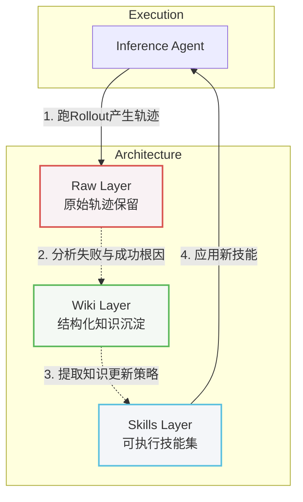

    

        

            

            

            

        

        
bash

    

    

        
ckhuang@macbookpro:~$ 一个 Agent 到底凭什么越来越强？在大部分开发者的认知里，无外乎两条路：砸钱换更大的模型，或者死磕各种神乎其技的 Prompt。但在真实的工程落地中，我们经常会遇到一个痛点：Agent 在同样的复杂任务上反复踩坑。它没有“长记性”的机制。经验用一次就丢，何谈自我进化？ 

    

前两天，Google Research 团队发布了一项名为 **WikiSkill** 的最新研究（[arXiv: 2608.27454](https://arxiv.org/abs/2608.27454)），给出了一条让我这个在分布式架构和数据领域摸爬滚打十多年的老兵都拍案叫绝的路径：**给 Agent 搭一套三层知识架构，把“经验”和“知识”彻底解耦。**

以往的技能进化方法（如 EvoSkill、SkillOpt 等）往往是分析完执行轨迹后直接修改技能代码，缺乏中间的缓冲与沉淀。而 WikiSkill 引入了一个持久化的知识库层，让零散的经验先沉淀为结构化知识，再通过知识去驱动技能的迭代。这与我们在大数据架构中构建“离线数仓（沉淀）+ 实时服务（执行）”的理念有着异曲同工之妙。

## 一、架构解析：解耦经验、知识与技能

在构建复杂的 AI Agent 系统时，架构的职责划分直接决定了系统的上限。WikiSkill 将 Agent 的进化机制切分为了三层：

### 1. Raw Layer（原始层）：进化的事实依据

这一层类似于我们系统架构中的 `Log 存储层`。它原汁原味地记录了每次迭代中 Agent 的完整推理过程、工具调用日志和输出结果。
**为什么要单独抽离？** 因为这一层是不可变的“真相（Truth）”。后续的两层在遇到问题或需要回溯时，都需要依靠这些原始数据来还原案发现场。如果原始数据在进化过程中被覆盖，整个进化机制就会变成空中楼阁。

### 2. Wiki Layer（知识层）：经验到知识的“数仓”

**这是整个架构的灵魂。** 它的作用是将原始轨迹（Raw Data）编译、清洗并沉淀为结构化的可复用知识。主要由三部分组成：

- **patterns/**：记录具体成功/失败策略的 markdown 库，并提供修复方案。
- **logs.md**：进化日志，记录改动历史。
- **skill-impact.md**：记录技能修改的接受与拒绝情况（带完整 Diff）。

在这个层级，有两个极其精妙的设计：

1.  **Wiki 永不回滚（Append-Only）**：即便一个新生成的 Skill 在测试中被拒绝了，Skill 可以回滚，但“这个改法为什么失败”的知识会被永久记录在 Wiki 中。这就避免了 Agent 在同一个地方跌倒两次。
2.  **Knowledge 与 Skill 分离**：知识库回答的是“我们知道什么规律”，而技能库回答的是“我们该怎么执行”。将二者解耦，确保了修改底层技能逻辑时，不会丢失其背后的决策上下文。

### 3. Skills Layer（技能层）：带溯源机制的执行体

这一层是当前生效的策略集合，直接供 Agent 调用执行。
每个技能目录下不仅有 `SKILL.md`（具体技能内容），还有 `PURPOSE.md`。这个 `PURPOSE.md` 解决的是“溯源”问题——它指向 Wiki 层中的某个 Pattern，让后续的迭代程序（Skill Proposer）能够清晰地知道：这个补丁最初是为了解决什么问题而打上的。这与我们在企业级架构中强调的“代码必须关联需求 Ticket/设计文档”是完全一致的工程素养。

    “不要把业务逻辑（Skill）和领域认知（Knowledge）揉成一团，架构的优雅往往来自于克制的解耦。” —— CK·黄

## 二、四大步骤：Agent 的自我进化闭环

有了三层架构的支撑，Agent 的进化就可以跑在一个严谨的飞轮上。每一轮迭代包含四个步骤：

1.  **Inference Agent（推理执行）**：Agent 使用当前的 Skill 在训练集上执行任务，并将轨迹写入 Raw Layer。注意，此时绝不能让 Agent 访问 Wiki，否则就变成了“开卷考试”，无法暴露出真实的短板。
2.  **Wiki Maintainer（知识维护）**：分析采样后的成功与失败轨迹，进行根因分析（RCA），并将结论结构化后沉淀到 Wiki 的 Pattern 目录。
3.  **Skill Proposer（技能提议）**：这部分程序像一个架构师，阅读 Wiki 索引、查阅历史影响评估（skill-impact），必要时下钻到具体的 Pattern 和 Raw 轨迹，最终提出一个新的 Skill 或补丁。
4.  **Gating（准入控制）**：在验证集上跑评估。如果指标提升，就合并到主干（接受）；否则回滚技能层，但将“失败教训”保留在 Wiki 层。

没有中间这层 Wiki，Proposer 每次都要面对海量无序的原始日志重新开始分析；有了 Wiki，Agent 就具备了真正的“长期记忆”与“抽象反思”能力。

## 三、深层洞见：规模无法掩盖架构的缺失

论文中有一组非常有意思的实验数据：

- **能力互补**：在 Qwen 家族中，WikiSkill 带来的提升与模型规模成正比（4B +12.3分，9B +17.5分，27B +23.9分）。这打破了“小模型才需要花里胡哨的框架”的刻板印象。越强的底座，越能从结构化的经验中榨取价值。
- **跨维打击**：使用了 WikiSkill 的 Qwen-3.5-9B，在表现上超过了没有使用技能的 Qwen-3.6-27B。这证明了**架构设计的红利足以弥补参数规模的绝对劣势**。
- **技能的跨模型迁移**：用 27B 模型进化的技能，反哺给 9B 模型使用，效果竟然比 9B 模型自己进化的技能还要好（70.2% vs 63.4%）。这意味着“发现策略（大脑）”和“执行策略（手脚）”完全可以剥离！我们可以用昂贵的大模型作为 Wiki Maintainer 沉淀知识，用便宜的小模型作为 Inference Agent 去执行，极大地降低落地成本。

## 写在最后

WikiSkill 的本质，并不是发明了某种神奇的新算法，而是将软件工程领域沉淀多年的**架构思想（分层、解耦、溯源、版本控制）**引入了 Agent 的进化机制中。

作为开发者，如果你还在每天为了榨取几个百分点的准确率而死磕 Prompt 或者盲目追求千亿参数模型，不妨停下来思考一下系统的整体架构。搭建一套能够让经验沉淀为知识、让知识驱动技能演进的基础设施，才是让你的 AI 员工（Agent）具备持续进化能力的底层逻辑。
