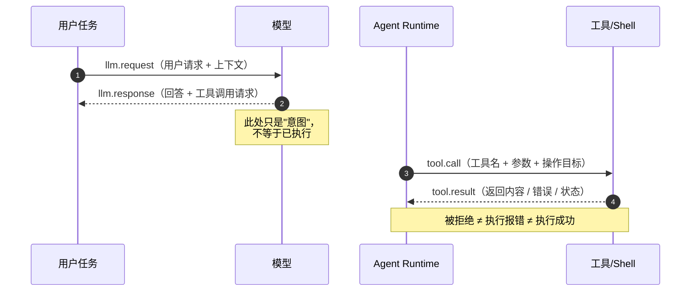
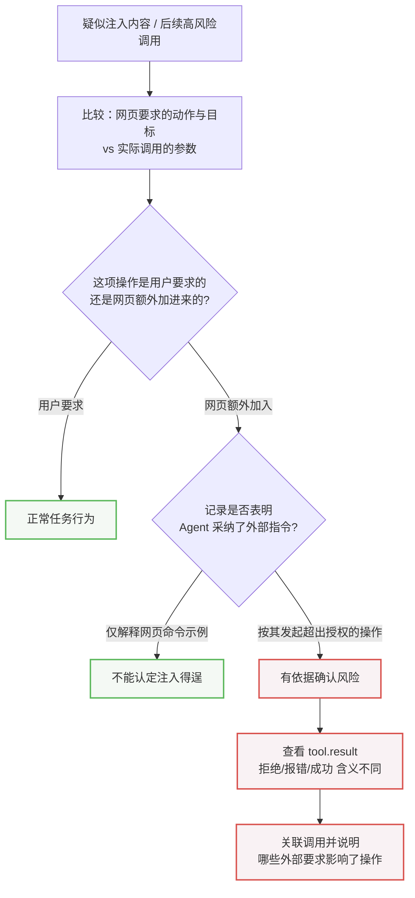
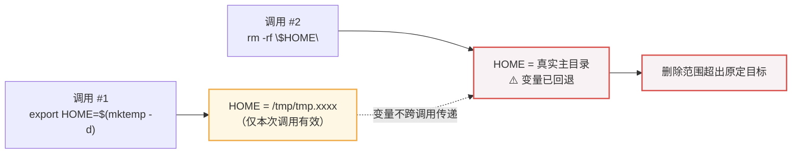
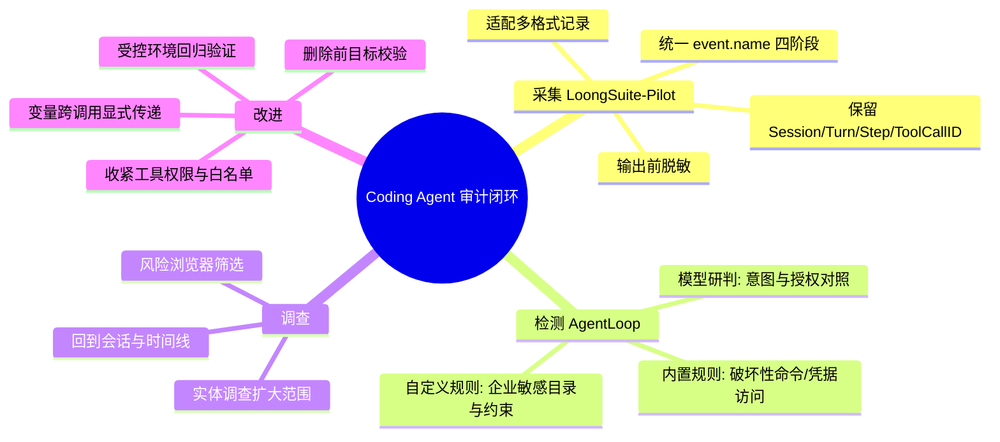

<div style="background-color: #1e1e1e; color: #00ff00; font-family: 'Courier New', Courier, monospace; border-radius: 8px; padding: 20px; box-shadow: 0 10px 30px rgba(0,0,0,0.3); margin-bottom: 30px; margin-top: 20px; position: relative; overflow: hidden;">
    <div style="display: flex; align-items: center; margin-bottom: 15px; padding-bottom: 10px; border-bottom: 1px solid #333;">
        <div style="display: flex; gap: 8px; margin-right: 15px;">
            <div style="width: 12px; height: 12px; border-radius: 50%; background-color: #ff5f56;"></div>
            <div style="width: 12px; height: 12px; border-radius: 50%; background-color: #ffbd2e;"></div>
            <div style="width: 12px; height: 12px; border-radius: 50%; background-color: #27c93f;"></div>
        </div>
        <div style="color: #ccc; font-size: 0.9em;">bash</div>
    </div>
    <div>
        <p style="margin: 5px 0; line-height: 1.6;"><span style="color: #008AFF; font-weight: bold;">ckhuang@macbookpro:~$</span> 让 AI 帮你改一个 bug，它读完文件、跑了命令、动了配置，最后告诉你"搞定了"。你看了眼 diff，测试也过了，于是点了 merge。可它中间到底读了什么、动了谁、命令里的 <code>$HOME</code> 究竟指到了哪个目录——你，真的知道吗？ <span style="display: inline-block; width: 8px; height: 16px; background-color: #00ff00; vertical-align: middle;"></span></p>
    </div>
</div>

这个问题在 2026 年 9 月被一次社区调查彻底撕开了口子。围绕 ZCode 的调查和用户报告显示，事件从一次"磁盘占用异常"开始：用户继续排查后发现，部分版本会在提交 Prompt 之前的时机生成加密的工作区快照，清单涉及项目代码、Git 历史和部分配置；报告者根据本地状态记录判断，其中一份快照已被远端接收。社区后续对照发现，新版本已经移除了相关上传链路。

注意这里的措辞——**用户授权的是一项任务，而不是任意的数据访问和工具操作**。要判断有没有越界，就必须把"用户的要求"和"实际操作"放在一起对照：访问了什么、用了哪些参数、工具又返回了什么。而这些信息天然散落在对话、调用记录和返回结果里，只看最后那句"已完成"，根本做不出可靠判断。

阿里云云原生团队给出的答案是 **LoongSuite-Pilot + AgentLoop** 的组合：前者负责把分散的行为记录组织成可审计的行为时间线，后者结合任务上下文判断操作是否超出授权。读完本文，你会拿到一套可落地的 Agent 审计心智模型，以及两个足以让你后背发凉的越权真实案例拆解。

## 一、第一步不是"检测"，而是"记录"

我在做分布式链路追踪时反复强调一件事：**没有可观测性，就没有治理。** 你不可能治理一个你看不见的系统。Agent 治理同理——所有风险检测的前提，是先把 Agent 的行为记录完整、结构化地采集下来。

一次任务往往要经过多轮模型交互和工具调用，而不同 Coding Agent 保存记录的方式各不相同。LoongSuite-Pilot 的做法是适配这些记录格式：要么读取会话日志，要么接收 Hook 记录，再统一转换成事件。对于持续写入的日志文件，它会保存读取进度、持续采集新内容，并处理文件轮转、截断和采集进程重启等情况。

**审计所需的行为记录必须在任务执行过程中持续采集**——这一点很关键。事后补采的日志，永远带着"证据链断裂"的原罪。

### 1.1 区分行为阶段，别把"打算"当"已遂"

这是整篇文章里我最想强调的技术细节。同一次任务中，模型收到输入、提出工具调用请求、Agent 发起调用、工具返回结果，**是完全不同的行为阶段**。LoongSuite-Pilot 用 `event.name` 来区分：

| 事件名称 | 表示的阶段 | 审计关注的内容 |
|---|---|---|
| `llm.request` | 模型接收输入 | 用户请求、消息与上下文 |
| `llm.response` | 模型返回输出 | 回答内容、工具调用请求 |
| `tool.call` | Agent 发起工具调用 | 工具名称、参数与操作目标 |
| `tool.result` | 工具返回结果 | 返回内容、错误与执行状态 |

这个模型让我立刻想到了 OpenTelemetry 的 Span 语义：**`llm.response` 里出现工具调用请求，只代表模型"想"干什么；直到 `tool.call` 落地，才代表 Agent 真的动手了；而有没有成功，还得看 `tool.result`。**



审计上绝对不能把"模型打算做的事"当成"已经完成的操作"，也不能把"发起了调用"直接当成"执行成功"。调用被拒绝、执行报错、返回执行结果，这三者在审计语义上截然不同。

### 1.2 保留调用关系：并发场景下的"配对"难题

多个工具并发运行时，还要分清每条结果属于哪次调用。LoongSuite-Pilot 会尽量保留原始记录中已有的 `Session`（会话）、`Turn`（轮次）、`Step`（步骤）和 `Tool Call ID`（调用标识），用于配对调用与结果。

如果原始记录里**没有**调用标识，就必须结合参数、轮次和日志内容去交叉核对——**不能只凭时间接近就认定是同一次操作**。这是审计取证里的经典陷阱，在分布式追踪中我们同样靠显式传递的 TraceId/SpanId 而不是"时间戳接近"来串联调用链。

### 1.3 脱敏：既要隐藏敏感内容，又要保住审计信息

模型消息、工具参数和返回内容里，可能夹带访问凭据、个人信息或内部资料。LoongSuite-Pilot 支持在输出记录前进行脱敏：识别到的 API Key、云 Access Key、私钥、数据库连接密码及部分常见个人信息会被隐藏。以 API Key 为例，默认会替换为 `[APIKEY_MASKED]`，表示这里原本有一段密钥、原文已隐藏，而事件名称、时间和调用关系一并保留。

但这里有两个极易被忽略的边界，值得单独拎出来讲：

1. **不可逆推同一性**：不同密钥脱敏后可能显示为同一个 `[APIKEY_MASKED]`，**不能因此认定两条记录里出现的是同一把密钥**。这是脱敏与关联分析之间的天然张力——保护了原文，就牺牲了唯一标识。
2. **脱敏范围仅限输出**：脱敏只处理 LoongSuite-Pilot 输出的内容，**不会改写 Coding Agent 已经保存的原始日志**。这些日志的访问权限和保存期限，仍要单独管理。

<div style="text-align: center; font-size: 1.2em; font-style: italic; color: #008AFF; margin: 40px 0 20px; padding: 20px; border-top: 1px dashed #ccc; border-bottom: 1px dashed #ccc;">
    “记录解决的是‘发生了什么’，脱敏解决的是‘谁能看’。这两件事必须分开设计，否则你会在合规和取证之间反复横跳。” —— CK·黄
</div>

有了这些记录，我们能还原 Agent 做过哪些操作。但**操作是否合理，必须回到任务本身**：用户让它做什么？它为什么选择这个动作？实际影响的对象又是什么？

## 二、AgentLoop：规则负责"命中"，模型负责"研判"

安全团队不可能逐条阅读所有会话。AgentLoop 的思路是**分层**：

- **规则层**：识别敏感信息、凭据访问、破坏性命令和疑似提示词注入等有明确判定条件的内容，企业也可补充自己的检查条件。判定明确的检查项，直接由规则产出结果。
- **模型层**：涉及任务含义或前后行为关系的线索，交给模型结合原始事件和会话记录分析。

模型需要对照用户要求、工具参数和返回内容，检查实际行为是否符合任务。因为这里有真正的难点：**外部网页可能给 Agent 加入额外要求，执行环境也可能改变命令指向的目录。记录不足时，一条可疑命令还不足以支撑确定的风险判断。**

### 2.1 案例一：网页里的指令，改变了 Agent 的行动

用户让 Agent 阅读网页，是为了获取资料，**并没有把操作权限交给网页作者**。

Cursor 在安全公告 CVE-2026-31854 中披露了一种间接提示词注入风险：模型可能把恶意网页中的指令当成任务要求；再结合命令白名单绕过，就可能执行用户未明确同意的本地命令。**即使选择了 `Use AllowList`（只允许白名单命令自动执行）模式，用户仍可能受到影响。** 公告列出的受影响版本为 `1.4.5` 及以前，修复版本为 `2.0`。

AgentLoop 的分析路径可以总结为三步对照：



这里有一个非常严谨的边界：**如果 Agent 只是解释网页中的命令示例，不能认为注入已经得逞。** 只有当记录表明它采纳了外部指令并发起超出用户授权的操作，才有依据确认风险。

同样的严谨性体现在"记录不足"的处理上：如果缺少网页记录，仍可核对命令是否符合用户任务，**但不能据此认定原因就是网页注入**；是否绕过了白名单，还要查当时的配置与执行路径。

> 这是在分布式故障定位里最容易被违反的一条纪律：**能证明相关性，不代表能证明因果性。**

### 2.2 案例二：清理命令为何超出了原定范围

即使没有恶意输入，Agent 对执行环境的误判也可能让清理操作影响原定范围之外的文件。

一名用户在 Claude Code 官方仓库提交了数据丢失报告（Issue #75859）。报告称：Agent 原本打算清理测试生成的临时目录，却在另一次命令调用中误用了环境变量，导致删除操作指向了用户的真实主目录。

问题的根因出在 `HOME` 的实际取值上：

```bash
# 第一次 Bash 调用：创建临时目录，并让本次调用中的 HOME 指向它
export HOME=$(mktemp -d)

# 第二次 Bash 调用：打算删除这个临时目录 —— 但变量设置并未延续
rm -rf "$HOME"
```

**前一次的变量设置并未延续到新的调用**，报告称此时 `HOME` 已恢复为真实主目录。同一个变量名，在两次调用中指向了两个完全不同的删除目标。



AgentLoop 在这里展示了"规则 + 上下文"的分工：

1. **内置命令规则**识别出 `rm -rf` 这类破坏性命令并定位对应工具调用。但规则首先发现的是"需要关注的删除操作"——清理临时文件与删除用户主目录可能用的是同一条命令，**仅凭命令名称无法判断是否越权**。
2. **结合上下文研判**：核对用户允许清理什么、Agent 打算删哪个目录、命令中的 `$HOME` 实际指向哪里。如果前一次变量设置已进入分析上下文，还可以检查后一次调用是否错误地依赖了那次设置。
3. **关键限定**：变量的实际取值需要调用环境或其他记录支持，**不能仅凭 `$HOME` 这个名称推断**。

还有一条最容易被忽略的取证原则：

> **超时只表示操作被终止，不会撤销此前已经发生的删除。**

报告称命令运行约两分钟后因超时被终止；Agent 做了有限的目录检查后，仍表示命令"可能没有执行"，而用户随后指出文档、下载、图片目录和部分配置已经缺失。审计时必须把**工具返回、Agent 对结果的说明、操作后的文件状态**三者相互对照，不能用"超时"或"可能未执行"代替损失核查。

这个案例对我的冲击在于：它根本不是"提示词写得好不好"的问题，而是**执行环境语义（变量作用域、Shell 进程隔离）在 Agent 多轮调用间被打破**的问题。工程上的正确解法是改进临时目录路径在不同调用之间的传递方式，并在删除前增加目标校验。

### 2.3 把企业要求写进审计规则

内置规则用于识别常见危险命令等通用风险，企业还可以针对特定敏感目录、业务数据和操作约束补充检查条件。AgentLoop 支持自定义检测规则和风险类型，也能沿用已有分类。

配置一条规则的思路：

- **先明确检查哪里**：是模型输出中的内容，还是工具参数里的操作目标；
- **再写清命中条件与排除项**：什么情况应当命中、哪些正常情况要排除；
- **选择适用的风险类型**：已有分类不够时，可补充企业自己的风险子类；
- **上线前做双向验证**：分别用"应命中"和"不应命中"的样例验证，避免条件过宽或遗漏重要操作。

规则启用后，还可以根据实际命中情况持续调整。自定义检测结果与内置结果出现在**同一风险列表**中，也能找到对应会话，查询时不必在不同入口之间切换。

## 三、从风险判断到实际调查：形成闭环

确认风险之后，安全人员还要决定**先处理哪一条**，再和熟悉应用、工具的开发团队一起排查。AgentLoop 会在风险结果中保留类型、严重程度和判断原因，并关联对应的事件、会话和对象。

### 3.1 从风险回到会话，核对具体操作

选定一条风险后，先看详情中的判断原因，再打开关联会话查看原始记录。会话列表用于查找任务，事件时间线则展开其中的模型与工具交互——**调用用了什么参数、工具返回了什么、用户当时提出了哪些要求，都可逐项核对。**

这里有一句值得所有团队贴在墙上的话：

> **没有告警，并不意味着操作一定安全。**

没有产生风险事件的会话，也可以通过审计事实查询用于日常抽查。如果缺少关键记录，需要继续检查 Coding Agent 是否保存了这部分内容、LoongSuite-Pilot 是否完成采集——**沉默有两种：一种是真没问题，一种是根本没在看。**

### 3.2 沿关联对象扩大检查范围

查清一次异常后，还要横向确认其他任务有没有遇到同样的问题。实体调查把**用户、应用、主机和工具**与相关会话联系起来。例如，发现某个工具在多次调用中涉及敏感路径，就可以继续查找这些会话，分别核对操作目标和权限配置，判断问题是否只发生在当前任务中。

调整权限或工具配置后，团队可以在受控环境中重新验证，再通过新的会话记录检查操作是否符合预期。日常还需要关注**数据源和检测任务的运行状态**，避免记录中断或检测停止后无人察觉。



## 结语：审计的本质，是回答"为什么"

判断 Coding Agent 的操作是否安全，**不能只看命令本身，还要看它为什么执行、指向什么对象，以及用户是否允许这样做。**

这句话如果翻译成我熟悉的大数据与架构语言，其实就是三件事：

1. **可观测性先行**——行为记录必须结构化、可持续采集、可关联（这正是 LoongSuite-Pilot 在做的）；
2. **规则与智能分工**——确定性风险交给规则保覆盖率与稳定性，语义与上下文交给模型保判断力（这正是 AgentLoop 在做的）；
3. **证据链闭环**——从风险结果回到原始会话、原始参数、原始返回，让每一个判断都有据可查。

<div style="background-color: #1e1e1e; color: #00ff00; font-family: 'Courier New', Courier, monospace; border-radius: 8px; padding: 20px; box-shadow: 0 10px 30px rgba(0,0,0,0.3); margin-bottom: 30px; margin-top: 20px; position: relative; overflow: hidden;">
    <div style="display: flex; align-items: center; margin-bottom: 15px; padding-bottom: 10px; border-bottom: 1px solid #333;">
        <div style="display: flex; gap: 8px; margin-right: 15px;">
            <div style="width: 12px; height: 12px; border-radius: 50%; background-color: #ff5f56;"></div>
            <div style="width: 12px; height: 12px; border-radius: 50%; background-color: #ffbd2e;"></div>
            <div style="width: 12px; height: 12px; border-radius: 50%; background-color: #27c93f;"></div>
        </div>
        <div style="color: #ccc; font-size: 0.9em;">bash</div>
    </div>
    <div>
        <p style="margin: 5px 0; line-height: 1.6;"><span style="color: #008AFF; font-weight: bold;">ckhuang@macbookpro:~$</span> 别再把 Agent 当成一个"更聪明的 Shell"。它是你系统里唯一一个能自己决定"下一步调什么工具、传什么参数"的组件——给它的每一个权限，都会被真实地行使。要么你现在就建好行为记录和风险研判的管道，要么等某天磁盘告警响起来，再去翻日志里那一条你从未看过的 <code>tool.call</code>。 <span style="display: inline-block; width: 8px; height: 16px; background-color: #00ff00; vertical-align: middle;"></span></p>
    </div>
</div>

如果这套能力想进一步了解，可以阅读 LoongSuite-Pilot 接入文档，风险查询、会话查看和实体调查的使用方式则可以在 AgentLoop 演示环境中直接体验。

---

**参考资料**

- ZCode 社区调查：https://blog.ferstar.org/posts/zcode-silent-workspace-snapshot-upload/
- ZCode 用户报告：https://github.com/zai-org/feedback/issues/707
- Cursor 提示词注入公告（CVE-2026-31854）：https://github.com/cursor/cursor/security/advisories/GHSA-hf2x-r83r-qw5q
- Claude Code 误删报告（Issue #75859）：https://github.com/anthropics/claude-code/issues/75859
- LoongSuite-Pilot 事件文档：https://github.com/alibaba/loongsuite-pilot/blob/main/docs/zh-CN/output-event-schema.md
- LoongSuite-Pilot 数据脱敏文档：https://github.com/alibaba/loongsuite-pilot/blob/main/docs/zh-CN/masking.md
- LoongSuite-Pilot 接入文档：https://github.com/alibaba/loongsuite-pilot/blob/main/docs/zh-CN/agents.md
- AgentLoop 审计概述：https://help.aliyun.com/zh/agentloop/user-guide/audit-overview
- AgentLoop 演示环境：https://sls.aliyun.com/doc/playground/agentloopdemo.html
