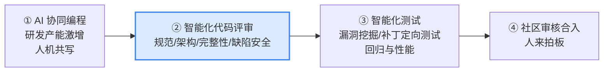
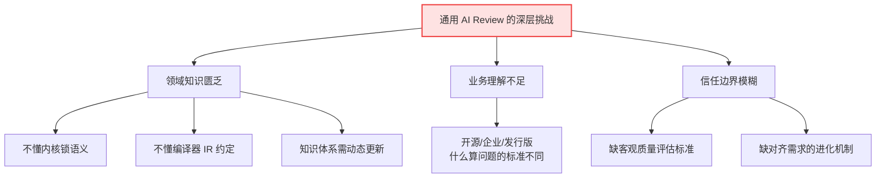
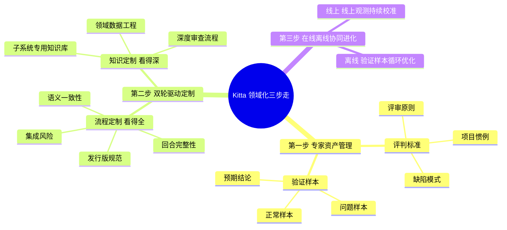
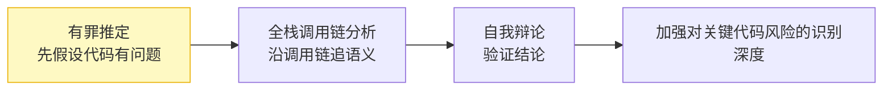
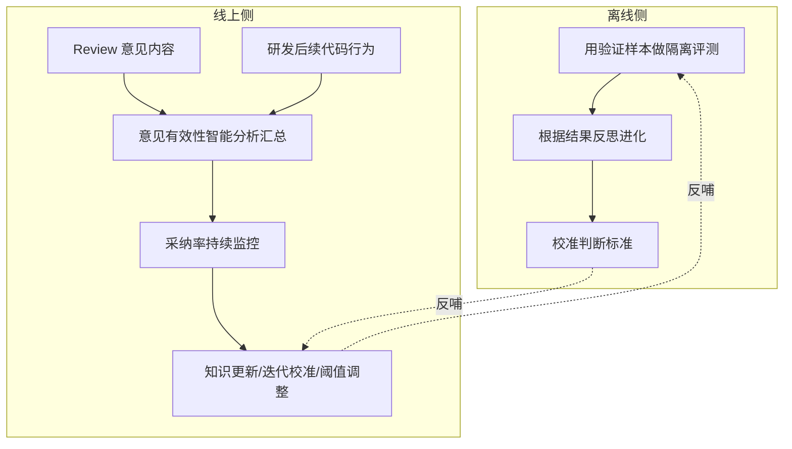
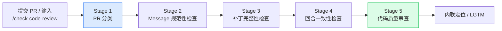
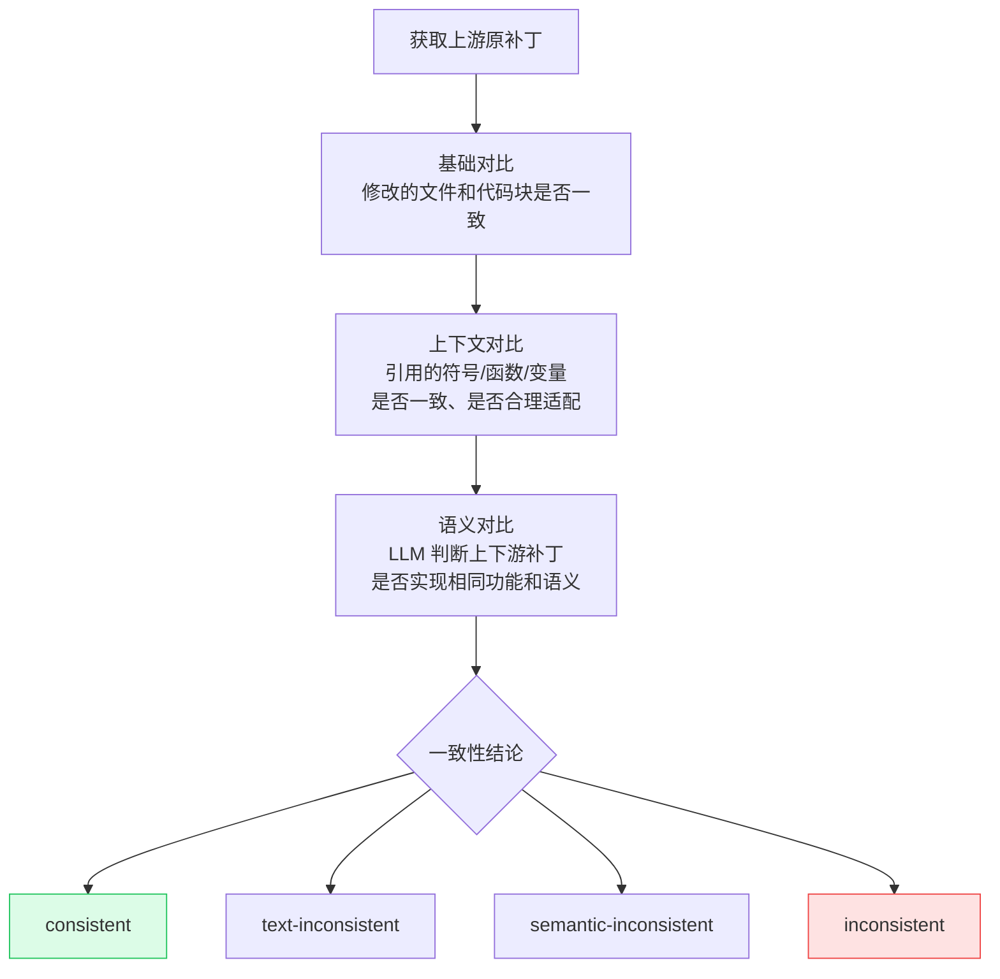

    

        

            

            

            

        

        
bash

    

    

        
ckhuang@macbookpro:~$ 过去一年最反直觉的变化是：写代码这件事，正在从「人力的瓶颈」变成「审查的瓶颈」。AI 让 PR 产量翻倍，但会看内核锁语义、看得懂编译器 IR 约定的 Reviewer，一个都没有变多。 

    

如果你在维护一个有年头的核心仓库，下面这个场景大概率不陌生：

早上打开 PR 列表，昨天还是 30 个待审，今天变成 60 个——因为团队刚给每个开发者配上了 AI 编码助手。产量上去了，但愿意逐行读内核补丁、能一眼看出「这个字段读取少了 `READ_ONCE()`」的人，还是那么几个。

**产能的瓶颈，正在从「写」转移到「审」。**

这篇文章要聊的，是阿里云《AI Agent Handbook》里介绍的一个案例——**Kitta**，一套面向领域深度定制的 Code Review Agent。它给了一组很硬的数据：

| 指标 | 数值 |
| :--- | :--- |
| 累计审查规模 | 7 万+ 补丁 |
| 门禁准确率 | 97% |
| 代码合入率 | 62% |

更值得关注的是它背后的方法论。Kitta 的核心命题不是「让 AI 能审代码」——这件事通用大模型已经能做——而是 **「让 AI 看懂项目」**。

读完这篇文章，你会拿到三样东西：

1. 为什么通用 AI Review 工具在核心业务里一定「差点意思」；
2. Kitta 用「领域化三步走」具体解决了什么；
3. 一套可以把任何通用 Agent 改造成领域专家 Agent 的可迁移思路。

## 一、先看数据：代码量暴涨之后，质量压力是怎么失控的

### 1.1 从内核到全行业，CVE 在加速

先摆几组数字，它们才是这整件事的起因。

Linux 内核上游修复 CVE 的数量正在快速攀升。内核 6.9 到 6.19 各版本大致还在四五百的区间，**到 7.0 已跳升至约 1250，7.2 更是逼近 1900，预估 7.3 版本时会超过 2000**。

放大到全行业更夸张。根据 Linux Foundation《The CRA Readiness Reality: What Changed and What Didn't Between 2025 and 2026》，CVE 同比增长为：**全部 +394%，高危 +811%**。

这组增长暴露的现状是：**代码缺陷暴露的量和危害程度，都在持续增加**。随之而来的是需要合入的代码量骤增。以龙蜥社区 ANCK 内核仓库为例，在 AI Agent 引入后，两个主流版本分支的合入 PR 持续攀升。

### 1.2 DORA 的报告更直接

研发效能侧的印证同样明确。DORA（Google Cloud 旗下的研发效能研究项目）在《State of AI-assisted Software Development》报告里给出：

| 指标 | 变化 |
| :--- | :--- |
| 代码 Bug 率 | +9% |
| 代码评审时间 | +91% |
| 平均 PR 体积 | +154% |

需要注意口径：该版本受访者约 5,000 人，这些数字是**相关性口径，而非因果结论**。但它指向的趋势很清楚——AI 深度参与开发的同时，评审侧的压力是成倍增加的。

> 编码已经不再受人力限制，但审查的人力并没有同步增长。

## 二、为什么 AI 评审必须放进 CI 流水线

龙蜥社区做的一件事很有启发：他们把持续集成升级成了**智能化持续集成（Agentic Continuous Integration）**，整条流水线分成四个环节：

关键在 ② 的位置。**AI 评审处在承上启下的位置**：

- 上游，AI 协同编程把代码产量抬了上去；
- 下游，智能化测试和社区合入都建立在一个前提上——**「进入测试和合入环节的代码是靠谱的」**。

如果评审环节失守，结果只有两种：要么缺陷漏到下游，要么 Maintainer 被人机共写产出的 PR 洪流淹没。这就是 Kitta 要解决的问题。

而智能化代码评审本身要覆盖的范围，比「找 Bug」宽得多：**研发规范与流程、架构与设计一致性、变更完整性与前置依赖、缺陷与安全风险**，四类缺一不可。

## 三、通用 AI Review 的两个「病根」

AI Code Review 的红利是显而易见的：响应速度显著提升，基础缺陷可以被自动拦截。但通用 Review 工具在核心业务里往往达不到**专家级可用**的标准。

拆开看，当前通用方案在两个维度上都有明显局限：

**维度一：工程行为约束不足。**

- **覆盖不全**：变更较大时倾向于只评审部分文件，导致遗漏；
- **位置漂移**：报告的问题与实际代码位置对不上；
- **效果不稳定**：评审质量随提示词的细微差异大幅波动。

**维度二：检查深度不足。**

- 缺乏对审查项目的语义理解，规则浮于表面；
- 对每个项目、每次评审一视同仁；
- 只能扫描代码本身的缺陷，感知不到项目特有的审查需求。

这些问题往下追，本质是三个深层挑战：

**领域知识匮乏**：跨领域技术栈差异大，且知识体系需要动态更新。通用模型见过很多代码，但未必懂内核的锁语义，也未必懂编译器的中间表示约定——而这些恰恰是评审结论对错的关键。

**业务理解不足**：项目开发模式多样，审查的定位与功能需要贴合业务场景。对社区开源项目、企业内部仓库、发行版维护来说，「什么算问题、问题有多严重」的标准截然不同。

**信任边界模糊**：缺乏客观的质量评估标准，以及难以对齐用户需求的进化机制。用户说「好」不一定是真的好，Agent 自我感觉良好更是靠不住——**没有客观的评估与进化闭环，信任就无从建立。**

> 当 AI 深度介入核心业务时，AI 能「看懂」代码，却未必「看懂」项目。

## 四、Kitta 的解法：把通用 Agent 领域化的「三步走」

针对这三个挑战，Kitta 的实践方案是把通用 Agent 领域化，通过「三步走」构建真正懂行的专家级 Code Review Agent。

### 4.1 第一步：项目级专家资产管理

领域知识不是凭空来的，而是**从真实历史中提炼的**。

Kitta 从社区研发历史中的真实评审与缺陷记录出发，覆盖项目 GitHub 仓库等多源数据。原始记录经过 **采集关联 → 规整去噪 → 语义解析 → 隔离复现**，沉淀为项目级专家资产。

这里有个细节值得单独拎出来：**「隔离复现」**。它的目的是让每一条缺陷模式与预期结论都可验证、经得起追问，**而不是把噪音当经验**。这个动作决定了资产的质量上限——没有可复现性，沉淀下来的就是一堆似是而非的「伪经验」。

这份资产包含两类核心内容：

| 资产类型 | 包含内容 | 回答的问题 |
| :--- | :--- | :--- |
| **评判标准** | 评审原则、缺陷模式、项目惯例 | 按什么标准判 |
| **验证样本** | 问题样本、正常样本、预期结论 | 判得对不对如何度量 |

这些资产**可验证、可沉淀、可复用**：换一个新项目，同样的管线可以把它的真实历史重新提炼成新的专家资产。

> 这一步的本质，是让「懂行」从一种个人经验，变成一种组织能力。

### 4.2 第二步：双轮驱动的代码审查定制

有了专家资产，接下来要解决「怎么看」的问题。Kitta 的做法是**双轮驱动**——流程定义**看哪里**，知识决定**怎么看**。

#### 轮子一：审查流程定制，让 AI 看得全

流程定制定义审查要看哪里，覆盖四个维度：

- **语义一致性**：防止补丁行为与预期背离；
- **回合完整性**：盯住跨版本补丁序列是否完整、有无遗漏；
- **发行版规范**：把关是否符合发行版的合入要求；
- **集成风险**：评估变更进入代码库后的连带影响。

以龙蜥社区 ANCK 的落地为例，流程定制的重点是**回合补丁 Code Review**。补丁回合是下游内核社区维护的高频操作：把上游补丁回合到下游时，往往要根据下游上下文做适配，既要准确判断适配是否正确，也要确认回合是否完整、有没有把上游后续的修复一并带回来。

围绕这个场景，Kitta 定制了两项内核特定审查视角：

**① 补丁语义一致性检查**——识别回合补丁与上游原补丁的差异，并结合语义判断补丁功能的一致性。方案上**先微观溯源、比对补丁级差异，再宏观评估整体功能是否一致**，避免「逐行都对、整体变了」的漏判。

**② 补丁完整性检查**——智能追踪回合补丁的上游依赖链，自动识别上游对应的 Fixes 补丁，采用**四阶段遗漏 Fixes 检索流程**，杜绝已知漏洞的回归。

此外，针对下游产品化流程中「代码本身的质量审查只是其中一个环节」的现状，Kitta 还覆盖了 PR 描述规范检查、描述与代码的一致性检查等流程类审查项，把审查范围从代码本身扩展到研发流程的完整上下文。

#### 轮子二：领域知识定制，让 AI 看得深

知识定制决定问题怎么判，依托**多源头层次化知识库**，做子领域拆分，沉淀典型缺陷模式，让 Agent 的判断贴合该领域专家的真实经验，而不是泛泛的「最佳实践」。

在 ANCK，这轮定制落地为三件事：

| 定制项 | 做什么 |
| :--- | :--- |
| 内核领域数据工程 | 收集多来源内核知识，经数据筛选、数据合成、数据均衡等流水线，得到领域知识库和 Benchmark 数据 |
| 子系统专用知识库 | 按子系统组织，让评审贴合各子领域的真实惯例 |
| 深度审查流程 | 引入「有罪推定—全栈调用链分析—自我辩论」流程 |

这里最值得玩味的是「深度审查流程」。它的逻辑是：

先用「有罪推定」打破模型的「讨好倾向」，再沿全栈调用链追语义，最后通过自我辩论验证结论——这套组合拳专门用来加强对内核常见关键代码风险的识别深度。

### 4.3 第三步：在线离线协同迭代进化

领域知识是活的，Agent 也要持续进化。Kitta 采用**在线离线协同**的迭代机制。

其中线上侧有一个设计我特别认同：**不看用户说什么，看用户做了什么**。评估框架基于 Review 意见内容和研发的后续代码行为，对各类意见有效性做智能分析汇总，结合采纳率持续监控、知识更新、迭代校准与阈值调整，让 Agent 在真实使用中越用越准。

## 五、落地效果：五阶段流水线怎么跑

Kitta 已在龙蜥社区的真实研发流水线中持续落地运行，沿一条完整的**五阶段流水线**对每一个内核 PR 进行审查。开发者提交 PR 或在评论中输入 `/check-code-review` 后，审查任务即被触发；整个流程**先分类、再检查规范与依赖、最后落到代码质量，层层递进**。

**Stage 1｜PR 分类。** Kitta 先判断这是纯自研补丁还是回合补丁：如果 Commit 中存在类似 `commit xxxx upstream` 的上游补丁声明，则归为回合补丁。**分类决定后续检查范围**——纯自研补丁不会执行补丁完整性检查和回合一致性检查，避免不必要的开销。

**Stage 2｜PR/Commit Message 规范性检查。** 基于龙蜥社区规范文档，对 PR 描述、Commit Title、Commit Message 等进行检查。这一步看起来「轻」，却能提前拦住大量因描述不清、标题不规范导致的维护成本。没有问题则不报告；有问题则给出 Message 规范建议。

比如它会直接指出：

> PR 标题未遵循社区规范……根据规范，应以 `[内核版本号] [Feature] : <描述>` 格式命名……

**Stage 3｜补丁完整性检查。** 针对回合补丁，Kitta 会智能追踪其上游依赖链，自动识别上游对应的 Fixes 补丁，按「检索上游 Fixes → 判断是否在 PR 中 → 判断是否在下游仓库已存在」的流程排查遗漏。检查结果分三类：

| 检查结果 | 含义 |
| :--- | :--- |
| 无遗漏 Fixes | 无需补充 |
| 已合入的 Fixes 补丁 | 相关修复已存在于下游仓库 |
| 遗漏的 Fixes 补丁 | 要求开发者补充，防止已知漏洞被重新引入下游 |

**Stage 4｜补丁回合一致性检查。** 对于声明了上游来源的回合补丁，Kitta 会先获取上游原补丁，再从**三个层次**对比：

结果从 `consistent` 到 `text-inconsistent`、`semantic-inconsistent`、`inconsistent` **分层输出**，让开发者和 Maintainer 快速定位差异性质。这个分层很关键：它把「不一致」从一个是非判断，变成了一个**有严重程度梯度的结论**。

**Stage 5｜代码质量审查。** 最后落到代码本身，Kitta 将审查出的问题按严重程度分为 `Critical`、`Medium / Low`，Critical 问题通常会**以内联评论定位到具体代码行**，需要开发者处理或明确是否为误报；未发现风险则给出 `LGTM`。

一个真实的 Medium 问题长这样：

> 在 `kvm_pv_vcpu_idle_exit()` 中读取共享字段 `idle_accum` 时（第 393 行）缺少 `READ_ONCE()`，可能导致编译器优化引发非预期行为。应使用 `READ_ONCE(vcpu->idle_accum)` 来确保正确读取。

这就是「懂行」和「扫语法」的区别——通用工具看不出 `READ_ONCE()` 的缺失，因为它不是语法错误，而是**并发内存模型层面的约定**。

## 六、用数据证明「懂行」：可量化的效果

Kitta 上线至今的核心运行数据：

| 指标 | 数值 |
| :--- | :--- |
| 审查规模 | 7 万+ |
| 门禁准确率 | 97% |
| 代码合入率 | 62% |

基于线上评估框架对 Kitta 上线以来处理过的**所有已合入 PR** 进行回溯统计，两类核心场景都取得了可量化的效果：

| 场景 | 意见采纳率 | 准确率 |
| :--- | :--- | :--- |
| 回合补丁场景（一致性检查） | 70.4% | 99.8% |
| 自研 PR 场景（Code Review） | 41.8% | 73.6% |

这份数据里藏着两个很诚实的信号：

**信号一**：回合补丁场景的准确率高达 99.8%，因为这是一个**边界清晰、可验证**的任务——上游原补丁就在那里，对比逻辑明确。这正是「领域定制」的价值所在：**把模糊的「审得好不好」，收敛成明确的「一致性对不对」。**

**信号二**：自研 PR 场景准确率 73.6%，明显低一档。这恰恰说明**通用性的审查更难**，也说明 Kitta 团队没有粉饰数据——他们把这些差距转化成了 Skill 迭代的优先级。

### 6.1 Benchmark 评估体系：让定制效果可衡量

为了让定制效果可衡量，Kitta 构建了 Benchmark 评估体系，基于三类来源收集数据：

| 数据来源 | 特点 | 作用 |
| :--- | :--- | :--- |
| LKML | 真实社区 Reviewer 的评审过程，问题分布均匀、真实性强 | 对齐真实社区 Reviewer 的判断标准 |
| sashiko benchmark | 单 commit—单 issue 精确对应 | 让能力改进方向足够聚焦 |
| 龙蜥 Gitee 社区数据 | 实际服务仓库语境 | 把评估拉回真实业务 |

并引入 **sashiko、review-prompts、qoder** 等多个 SOTA 代码审查工作参与横向评估，用对比结果指导 Skills 进化。Kitta 能清楚看到自身在特定缺陷类型、特定子系统上的差距，并把这些差距转化为迭代优先级。

> 不能被度量的「变好」，都只是自我感觉良好。

### 6.2 跨领域通用实践

Kitta 的能力并不局限于内核。通过把专家资产和审查流程抽象为**可迁移的 Skill**，它已经在六个领域完成验证：

| 领域 | 审查质量提升 |
| :--- | :--- |
| 操作系统内核 | 20.4% |
| 编译器 | 24.4% |
| 文件系统 | 17.0% |
| 网络系统 | 19.8% |
| 云原生平台 | 31.6% |
| AI 计算框架 | 21.7% |

这些领域共同的特点是**代码规模大、语义深、审查门槛高**。跨领域的稳定提升（17.0%–31.6%）说明 Kitta 的「领域定制」方法论具有**通用性**：无论是内核的锁语义、编译器的中间表示，还是云原生平台的配置约定，都可以通过沉淀专家资产、定制审查流程来构建专家级 Review 能力。

### 6.3 数据飞轮：数据向下沉淀，能力向上反哺

Kitta 在服务过程中还在持续沉淀数据，与千问基座模型之间形成「数据向下沉淀、能力向上反哺」的飞轮：

| 沉淀的数据 | 反哺的能力 |
| :--- | :--- |
| 专家标注的 Benchmark 基准数据集 | 漏洞发现能力——更深入的语义理解与潜在漏洞发现 |
| Agent 思维链轨迹跟踪数据 | 指令跟随能力——更准确的工具调用与指令遵循 |
| 用户偏好对齐数据 | 用户对话能力——贴近用户需求的评审意见表达 |
| 用户后续 Coding 动作 | 代码生成能力——更好的跨语言 Coding 与 Debug 能力 |

评审过程中产生的专家标注、思维链轨迹、用户偏好与后续代码改动，**既是改进 Review 服务本身的燃料，也在反哺基座模型更基础的能力**。更重要的是，这些数据来自真实的社区运行，而不是人工构造的静态数据集，因此每一次迭代都在让 Kitta 更贴近实际研发场景。

## 七、实践总结：AI Code Review 的边界与共识

经过落地实践，Kitta 团队发现：要想最大化 AI Code Review 的效果，首先需要明确的是 **AI 与人在协作中的信任边界**。他们遵循三条原则：

**① 精准分级，克制打扰——严守门禁底线，释放建议空间。**
对安全漏洞和破坏坚决拦截 CI 流程，这是底线；其余问题分级呈现、仅作提示，不过多占用开发者的注意力，平衡问题披露阈值。

**② 行为作证，拒绝自嗨——用户可能沉默，但代码变更骗不了人。**
不把开发者的默默无视当成认可，不看用户说什么，看「代码改了什么」：通过置信度熔断与追踪真实代码变更，基于客观变更驱动审查和模型迭代。

**③ 人类兜底，适时退场。**
AI 是探照灯，照亮风险、给出证据；Maintainer 是方向盘，最终决策权在人，是最后一道防线。

这三条原则，其实正好回答了本文开头那个「信任边界模糊」的挑战。

    “最好的 AI 门禁，不是替代 Maintainer，而是让他们只把精力花在真正需要人类智慧的地方。” —— CK·黄

回头看 Kitta 这条路，最值得抄的不是它接了什么模型，而是那套「从真实历史提炼专家资产 → 双轮驱动定制 → 在线离线协同进化」的方法论。

它给出一个更大的启示：**通用 Agent 的能力上限，往往不取决于基座模型有多强，而取决于你有没有把「领域经验」工程化成可验证、可复用的资产。** 这条路径不限于 Code Review——任何「领域门槛高、历史数据厚、人对结果有判断力」的场景，都值得用同样的三步走重来一遍。

毕竟，AI 能不能「看懂代码」早就不是问题了。真正的问题是：它什么时候才能「看懂你的项目」。
